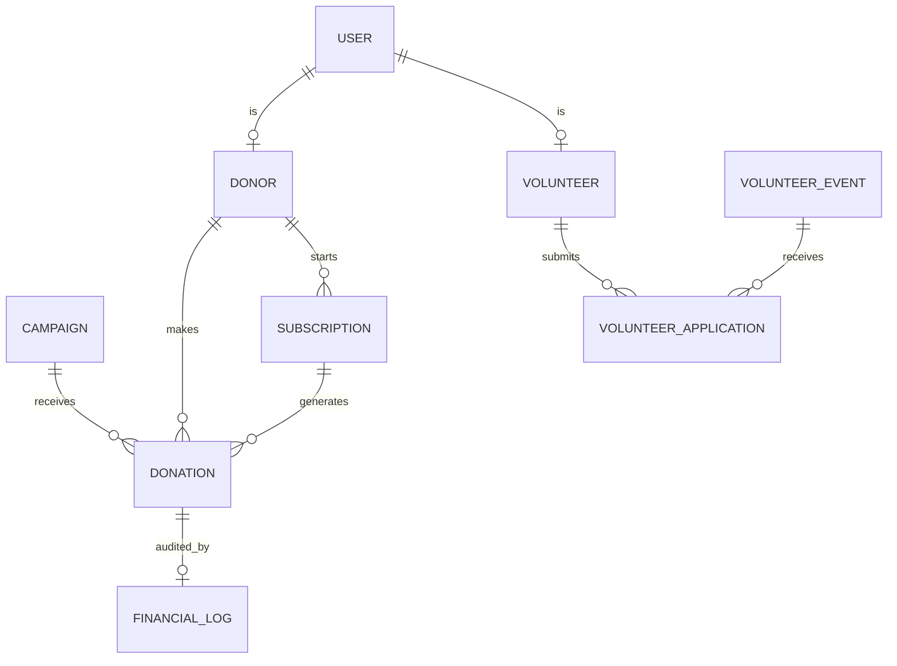

# CharityHub - Condensed Documentation

**Version:** 1.0 (Summarized) | **Last Updated:** May 15, 2026

---

## 1. Database Schema

CharityHub utilizes a relational structure centered on Fundraising, Volunteering, and Operations.

### Core Tables

*   **Users**: Auth and RBAC (`admin`, `employee`, `user`).
*   **Donors**: Profiles with GDPR consent tracking (`gdpr_consent`, `gdpr_consent_at`).
*   **Campaigns**: Fundraising targets with status tracking (`active`, `paused`, `completed`, `ended`).
*   **Donations**: Records of one-time and recurring payments with gateway transaction IDs.
*   **Subscriptions**: Management of recurring billing via Stripe.
*   **Financial Logs**: **Immutable append-only** audit trail. Each entry includes a SHA-256 HMAC hash to detect tampering.
*   **Volunteers**: Profiles including skills, availability, and approved hours.
*   **Volunteer Events**: Public opportunities linked to applications and attendance logs.

### Entity Relationship Overview

---

## 2. Payment Flow Diagram (Stripe Integration)

### One-Time Donation Flow
1. **Donor Submission**: Client-side `idempotency_key` generated.
2. **Session Creation**: Backend creates Stripe Checkout Session.
3. **Redirection**: Donor completes payment on Stripe's PCI-compliant page.
4. **Webhook**: Stripe sends `charge.succeeded`.
5. **Finalization**: System updates donation to `completed`, generates an immutable `financial_log`, and triggers tax certificate generation.

### Recurring Donation Flow
1. **Setup**: Donor chooses frequency (Monthly/Yearly).
2. **Subscription**: Stripe handles recurring billing cycles.
3. **Renewal**: On success, `invoice.payment_succeeded` webhook creates a new donation record and audit log entry.

---

## 3. API Documentation

### Authentication
*   Required for all non-public endpoints.
*   Method: Laravel Session or Bearer Token.

### Key Endpoints
*   `POST /donate/checkout`: Initialize Stripe payment. Requires `amount`, `campaign_id`, and `gdpr_consent`.
*   `GET /donor/dashboard`: Retrieve donor stats, active subscriptions, and certificates.
*   `POST /donor/subscriptions/{id}/cancel`: Immediate cancellation of recurring donations.
*   `GET /admin/ledger`: (Admin/Employee) Access the immutable financial audit trail.
*   `GET /verify/{uuid}`: (Public) Authenticate a donation certificate via its unique ID.

---

## 4. Donor-Facing User Guide

### Donations
*   **One-Time**: Select campaign → Enter amount → Complete Stripe checkout.
*   **Recurring**: Opt-in to "Make it recurring" during checkout. Manage/Cancel anytime via the Dashboard.
*   **Privacy**: Use the "Anonymous" toggle to hide your name from public donor lists.

### Dashboard & Certificates
*   **Tax Certificates**: Automatically generated as PDFs after successful payment.
*   **Data Portability**: Download all personal data in JSON format from account settings.

---

## 5. Admin Operations Manual

### Financial Management
*   **Ledger**: Monitor all transactions. A "Tampered" warning appears if hashes do not match.
*   **Refunds**: Process refunds directly through the dashboard; triggers Stripe API reversal and immutable log entry.

### Volunteer Coordination
*   **Applications**: Review and Approve/Reject volunteer sign-ups.
*   **Hours**: Verify and approve hours logged by volunteers to update impact metrics.
*   **Events**: Create and manage public volunteering opportunities.

---

## 6. Compliance & Data Security

### GDPR Compliance
*   **Lawful Basis**: Processing is based on Consent (marketing), Contract (donations), and Legal Obligation (tax).
*   **Data Rights**: Built-in tools for Access (DSAR), Rectification, and Erasure (anonymization).
*   **Retention**: Financial records are retained for 7 years; audit logs for 3 years.

### Financial Security
*   **PCI-DSS**: No card data is stored on local servers; tokenization handled by Stripe.
*   **Encryption**: All traffic forced over HTTPS/TLS 1.2+.
*   **Fraud Detection**: Includes IP velocity checks, email verification, and transaction amount limits.
